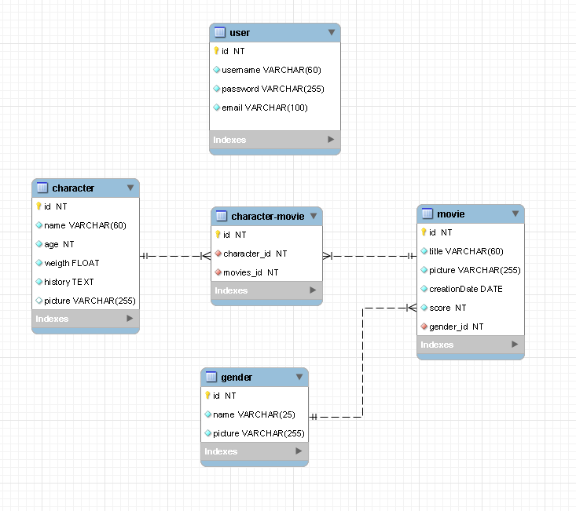

# ALKEMY NODE.JS CHALLENGE

## Modelado de la Base de datos

## Como usar el repositorio

1. Instalar las dependencias con el comando yarn.
2. Crear una nueva base de datos en MySql llamada "disney".
3. Crear un archivo .env y hacer copy paste de lo que esta en el .env.example (en caso de desear cambiarlo es posible y tiene valores por defecto en el config.js exceptuando los datos del mail en caso de no pasarle nada y dejarlo tal cual esta).
4. Iniciar el proyecto con el comando yarn start.
5. Ejecutar el script sql para tener data dami.

**Para conocer como usar los enpoints ingresar al endpoint "/doc"**

**Tomar en cuenta que todos los registros tendran la imagen por defecto, la cual es posible cambiar sin problema
en cualquier registro a excepcion de los generos ya que los mismos no poseen endpoints.**
